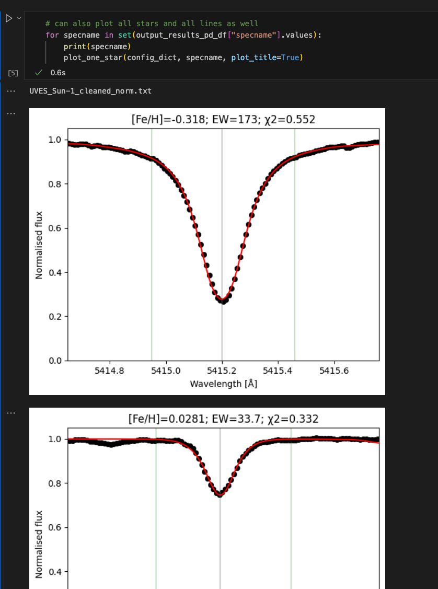

# Turbospectrum Spectral Fitting with Python (TSFitPy)

TSFitPy is a pipeline designed to determine stellar abundances and atmospheric parameters through the use of Nelder-Mead (simplex algorithm) minimization. It calculates model spectra "on the fly" while fitting instead of using a more sophisticated method that relies on training neural networks (such as the method used by the full SAPP used for much larger datasets). Using this method allows the pipeline to gain flexibility in the stellar physics used at the expense of computation time, which makes it useful for small datasets of ~100 stars and fewer.

To use TSFitPy, you will need a working Turbospectrum (TS) installation of the latest version, which has the capability to compute NLTE line profiles as well as calculate specified spectral windows instead of a full spectrum for a given range. TSFitPy has not been tested on older versions of TS. The latest version of TS can be found here: https://github.com/bertrandplez/Turbospectrum_NLTE

The code requires at least version Python 3.7. It also makes use of fortran programs, which will need to be compiled on the user's machine (intel fortran ifort/ifx compiler highly recommended). The Python packages needed are as follows (they should all be installable via "pip install"):
- Numpy
- Scipy (at least 1.7.1)
- Dask (installed using `pip install dask[complete]`)
- dask-jobqueue (does NOT come by default with the Dask)
- Pandas
- Astropy
- Matplotlib (only for plotting)

Also, Windows is not supported (?).

There is a WIP (developed by NS only atm) GUI for TSFitPy (at least results plotting). You can see whether you might like it. It is available [here](https://github.com/stormnick/TSGuiPy).

## Acknowledgements

If you use this code, please acknowledge the authors of the code and the Turbospectrum code. Please reference the following papers:

- Original TS [Alvarez, R & Plez, B. 1998](https://ui.adsabs.harvard.edu/abs/1998A%26A...330.1109A/abstract)
- TS [Plez, B. 2012](https://ui.adsabs.harvard.edu/abs/2012ascl.soft05004P/abstract)
- TS NLTE + TSFitPy [Gerber, J. M. et al. 2023](https://ui.adsabs.harvard.edu/abs/2023A%26A...669A..43G/abstract) and [Storm, N. & Bergemann M. 2023](https://ui.adsabs.harvard.edu/abs/2023MNRAS.525.3718S/abstract)
- Solar abundances input [Bergemann, M. et al. 2021](https://ui.adsabs.harvard.edu/abs/2021MNRAS.508.2236B/abstract) and [Magg, E. et al. 2022](https://ui.adsabs.harvard.edu/abs/2022A%26A...661A.140M/abstract)
- 1D MARCS models [Gustafsson, B. et al. 2008](https://ui.adsabs.harvard.edu/abs/2008A%26A...486..951G/abstract)
- <3D> STAGGER models (if using those) [Magic, Z. et al. 2013](https://ui.adsabs.harvard.edu/abs/2013A%26A...557A..26M/abstract)
- Gaia-ESO linelist [Heiter, U. et al. 2021](https://ui.adsabs.harvard.edu/abs/2021A%26A...645A.106H/abstract)
  - With new atomic data for C, N, O, Si, Mg, as described in [Magg, E. et al. 2022](https://ui.adsabs.harvard.edu/abs/2022A%26A...661A.140M/abstract)
  - Gaps of it are filled with VALD (if using those) [Ryabchikova, T. et al. 2015](https://ui.adsabs.harvard.edu/abs/2015PhyS...90e4005R/abstract)

If you make use of the `teff` or `vmic` fitting methods, please acknowledge the following paper with the description of the method:

- D'Orazi, V. et al. [D'Orazi, V. et al. 2024](https://ui.adsabs.harvard.edu/abs/2024MNRAS.tmp.1155D/abstract)

If you make use of the NLTE data, please acknowledge the appropriate papers for the NLTE data used (different one for each element!):

- H: [Mashonkina, L. et al. 2008](https://ui.adsabs.harvard.edu/abs/2008A%26A...478..529M/abstract)
- O: [Bergemann, M. et al. 2021](https://ui.adsabs.harvard.edu/abs/2021MNRAS.508.2236B/abstract)
- Na (qmh): [Ezzeddine, R. et al. 2018](https://ui.adsabs.harvard.edu/abs/2018A%26A...618A.141E/abstract)
- Mg: [Bergemann, M. et al. 2017](https://ui.adsabs.harvard.edu/abs/2017ApJ...847...15B/abstract)
- Al (qmh): [Ezzeddine, R. et al. 2018](https://ui.adsabs.harvard.edu/abs/2018A%26A...618A.141E/abstract)
- Si: [Bergemann, M. et al. 2013](https://ui.adsabs.harvard.edu/abs/2013ApJ...764..115B/abstract) and [Magg, E. et al. 2022](https://ui.adsabs.harvard.edu/abs/2022A%26A...661A.140M/abstract)
- Ca: [Mashonkina, L. et al. 2017](https://ui.adsabs.harvard.edu/abs/2017A%26A...605A..53M/abstract) and [Semenova, E. et al. 2020](https://ui.adsabs.harvard.edu/abs/2020A%26A...643A.164S/abstract)
- Ti: [Bergemann, M. et al. 2011](https://ui.adsabs.harvard.edu/abs/2011MNRAS.413.2184B/abstract)
- Cr: [Bergemann, M. & Cescutti, G. 2010](https://ui.adsabs.harvard.edu/abs/2010A%26A...522A...9B/abstract)
- Mn: [Bergemann, M. et al. 2019](https://ui.adsabs.harvard.edu/abs/2019A%26A...631A..80B/abstract)
- Fe: [Bergemann, M. et al. 2012b](https://ui.adsabs.harvard.edu/abs/2012MNRAS.427...27B/abstract) and [Semenova, E. et al. 2020](https://ui.adsabs.harvard.edu/abs/2020A%26A...643A.164S/abstract)
- Co: [Bergemann, M. et al. 2010](https://ui.adsabs.harvard.edu/abs/2010MNRAS.401.1334B/abstract) and [Yakovleva, S.A. et al. 2020](https://www.mdpi.com/2218-2004/8/3/34)
- Ni: [Bergemann, M. et al. 2021](https://ui.adsabs.harvard.edu/abs/2021MNRAS.508.2236B/abstract) and [Voronov, Y.V. et al. 2022](https://ui.adsabs.harvard.edu/abs/2022ApJ...926..173V/abstract)
- Sr: [Bergemann, M. et al. 2012a](https://ui.adsabs.harvard.edu/abs/2012A%26A...546A..90B/abstract) and [Gerber, J. M. et al. 2023](https://ui.adsabs.harvard.edu/abs/2023A%26A...669A..43G/abstract)
- Y: [Storm, N. & Bergemann M. 2023](https://ui.adsabs.harvard.edu/abs/2023MNRAS.525.3718S/abstract) and [Storm, N. et al. 2024](https://ui.adsabs.harvard.edu/abs/2024A%26A...683A.200S)
- Ba: [Gallagher, A. et al. 2020](https://ui.adsabs.harvard.edu/abs/2020A%26A...634A..55G/abstract)
- Eu: [Storm, N. et al. 2024](https://ui.adsabs.harvard.edu/abs/2024A%26A...683A.200S)

## Quick start

This is a short version of the installation + running the code just to test that it works (not all inputs are downloaded). Please read the full version when you actually want to use the code.

- `git clone https://github.com/TSFitPy-developers/TSFitPy.git`
- `cd TSFitPy/turbospectrum/`
- `rm readme.txt`
- `cd ..`
- `git clone https://github.com/bertrandplez/Turbospectrum_NLTE.git turbospectrum`
- `cd turbospectrum/exec-intel/` (or `cd turbospectrum/exec-gf/` if using gnu compiler; or `cd turbospectrum/exec-ifx/` if using ifx compiler)
- if linux: uncomment `mcmodel=medium` in the makefile on line 11
- `make`
- `cd ../../`
- Download from [1D MARCS standard composition models](https://keeper.mpdl.mpg.de/d/6eaecbf95b88448f98a4/) file `atmospheres/marcs_standard_comp.zip` and put the unzipped files in `TSFitPy/input_files/model_atmospheres/1D/`
- Download from [NLTE Gaia-ESO linelist](https://keeper.mpdl.mpg.de/d/3a5749b0bb5d4e0d8f4f/) file `nlte_ges_linelist_jmgXX20XX_I_II` and put it in `TSFitPy/input_files/linelists/linelist_for_fitting/`
- `pwd` -> `TSFitPy/`
- `cp -r input_files/sample_spectrum/* input_files/observed_spectra/`
- `cp -r turbospectrum/interpolator/* scripts/model_interpolators/`
- `cd scripts/`
- `python3 compile_fortran_codes.py` (choose `GNU`, `IFORT` or `IFX` compiler)
- `cd ..`
- `python3 main.py ./input_files/tsfitpy_input_configuration.cfg`
- You should see something like this at the end of each line fit:
  - [...]
  - `[Fe/H]=-0.3180 rv= 0.3268 vmic= 1.0516 vmac= 2.4664 rotation= 0.0000 chisqr=    0.55214633`
  - `Converged: Fe: -0.32 Number of iterations: 14`
  - [...]
  - `[Fe/H]= 0.0282 rv= 0.2282 vmic= 1.0679 vmac= 3.7423 rotation= 0.0000 chisqr=    0.33176552`
  - `Converged: Fe: 0.03 Number of iterations: 10`
  - `Total runtime was XXXX minutes.`
  - `TSFitPy had normal termination`
  - `Fitting completed`
  - `End of the fitting: XXX-XX-20XX-XX-XX-XX`
- `cd plotting_tools/`
- `cp plot_output.ipynb plot_output_test.ipynb`
- open `plot_output_test.ipynb` and run the first cell
- change `output_folder_location` to the folder where the output is saved (e.g. you will find a folder `TSFitPy/output_files/XXX-XX-20XX-XX-XX-XX_0.XXXXXXXXXXXXXXXX_LTE_Fe_1D/`, so copy `XXX-XX-20XX-XX-XX-XX_0.XXXXXXXXXXXXXXXX_LTE_Fe_1D` and paste it instead of `OUTPUTCHANGEHERE`)
- run the next 5 cells to plot the results
  - 


## Installation

- Clone or download code to your favourite directory
- Download actual [TurboSpectrum fortran code](https://github.com/bertrandplez/Turbospectrum_NLTE) and put it into folder `TSFitPy/turbospectrum/`
- Compile TS fortran code using the make file in `turbospectrum/exec/` (or in `turbospectrum/exec-gf/` if using the gnu compiler)
  - You might need to uncomment `mcmodel=medium` in the makefile (linux only?)
- Copy fortran files (can copy everything if unsure) from `TSFitPy/turbospectrum/interpolator/` to `TSFitPy/scripts/model_interpolators/`
- Run `TSFitPy/scripts/compile_fortran_codes.py` using python to compile model interpolators
- Download all desired linelists and put them into `TSFitPy/input_files/linelists/linelist_for_fitting/`
  - Example VALD lines are included in the `TSFitPy/input_files/linelists/linelist_vald/`, which you can move to the `TSFitPy/input_files/linelists/linelist_for_fitting/` (they are LTE ONLY)
  - **ALTERNATIVELY** but **required** for the [NLTE Gaia-ESO linelists are provided here](https://keeper.mpdl.mpg.de/d/3a5749b0bb5d4e0d8f4f/) in the file `nlte_ges_linelist` (wavelength ranges: 4200-9200 Å)
  - Additional linelists to include are VALD ones (3700-3800, 3800-4200, 9200-9300, 9300-9800) that extend the wavelength regime of the Gaia-ESO linelist
    - Example of how your linelist files should look like:
      `TSFitPy/input_files/linelists/linelist_for_fitting/`
    
      |-> `nlte_ges_linelist_jmgDATE_I_II`
    
      |-> 	`vald-3700-3800-for-grid-nlte-DATE`
    
      |-> 	`vald-3800-4200-for-grid-nlte-DATE`
    
      |-> 	`vald-9200-9300-for-grid-nlte-DATE`
    
      |-> 	`vald-9300-9800-for-grid-nlte-DATE`
           
  - Molecular linelists may also be important. They are found in the same link as the Gaia-ESO linelist in the folder `molecules-420-920nm`, and put alongside other molecules (UNZIP them, they should have extension .bsyn)
  - **IMPORTANT**: ALL files in the `TSFitPy/input_files/linelists/linelist_for_fitting/` are used, so do NOT use BOTH Gaia-ESO and VALD data from same wavelength ranges (i.e. don't use both downloaded gaia-eso AND files from example `/linelist_vald/`)
- Download desired atmospheric models and put them into the `TSFitPy/input_files/model_atmospheres/` in either `1D` or `3D` folder and unzip them
  - [1D MARCS standard composition models are included here](https://keeper.mpdl.mpg.de/d/6eaecbf95b88448f98a4/) in the folder `atmospheres/marcs_standard_comp.zip`
  - 3D averaged STAGGER models can be included in the `3D` folder as well (same link, `atmospheres/average_stagger_grid_forTSv20.zip`)
    - These files have similar naming convention as MARCS, but they are NOT MARCS models
  - Unzip them, such as your model atmosphere files (e.g. `p2500_g+3.0_m0.0_t00_st_z+0.00_a+0.00_c+0.00_n+0.00_o+0.00_r+0.00_s+0.00.mod`) are in respectively:
    - `TSFitPy/input_files/model_atmospheres/1D/`
    - `TSFitPy/input_files/model_atmospheres/3D/`
- If desired to use NLTE data, then one needs to provide departure coefficient files. They can be downloaded from [NLTE dep grids here](https://keeper.mpdl.mpg.de/d/6eaecbf95b88448f98a4/) in the `dep-grids` folder.
  - The size of each file is big (anywhere from a few GB up to a few dozen GB), so only download relevant files
  - In the relevant element file you will find several files, for 1D MARCS you will need:
    - atom.ELEMENT_AND_NUMBER
    - auxData_ELEMENT_MARCS_DATE.dat
    - NLTEgrid_ELEMENT_MARCS_DATE.bin
  - The same idea applies for 3D averaged STAGGER atmospheres:
    - atom.ELEMENT_AND_NUMBER
    - auxData_ELEMENT_STAGGERmean3D_DATE_marcs_names.dat
    - NLTEgrid_ELEMENT_STAGGERmean3D_DATE.bin
  - The naming might vary, but use MARCS for 1D models, use STAGGERmean3D (with `_marcs_names`! for aux files) for average STAGGER models
  - For each element, download, unzip and place auxData and NLTEgrid into their own folder (e.g. `TSFitPy/input_files/nlte_data/Ba/`)
  - Put all relevant atom files into `TSFitPy/input_files/nlte_data/model_atoms/`
- Some default linemask files are already provided in the script; linemask are wavelength ranges where line will be fitted (i.e. left and right sides of the line)
  - They are located in the `TSFitPy/input_files/linemask_files/` and separated into individual folders
  - Each folder contains one file: `ELEMENT-lmask.txt`
  - You can also create your own linemasks.
  - To create your own linemask:
    - Create new textfile (naming doesn't matter)
      - First column: wavelength center of the line (no need to be exact, it is only used in printing)
      - Second column: left side of the line where it is fitted (i.e. include wings as well)
      - Third column: right side of the line where it is fitted
    - You can add comments using `;` (either on any line or after the line's values)

## TSFitPy usage

*When you don’t read the docs, every bug is a feature and every feature is a bug.*

While TSFitPy was set up to make it as user-friendly as possible, scientific cases require at least basic understanding of the code. Please take your time to get familiar with the code, the results and assumptions made. Please feel free to ask questions in the issues if something is unclear.

### Usage for fitting

- There are three main steps to take for every fit: get normalised spectra, create the corresponding fitlist and change the configuration (config) file
- As an example, we are going to use provided sample spectrum and change config file to fit the Sun
- Take spectrum from `TSFitPy/input_files/sample_spectrum/` and put it into desired folder, such as `TSFitPy/input_files/observed_spectra/`
  - One can also supply error as third column, but it is not required (otherwise it will be set to 0.01)
    - **ANY third column will be treated as an error, so make sure it is an error and not something else**
  - Error is sigma, i.e. standard deviation, not variance
  - Error is used in chi2 calculation (see docs for the exact formula)
- It is recommended to create a separate config file for each run/set of stars. This allows to quickly refit the same sample of stars without recreating config file each time
- Copy and paste the existing `TSFitPy/input_files/tsfitpy_input_configuration.cfg` and call it something like `TSFitPy/input_files/tsfitpy_input_configuration_sun_test.cfg`
  - The reason to copy and paste is so that `git pull` cannot interfere with the default configuration
- The config file should already be ready for a test run, but here is the reference breakdown if needed
  - [turbospectrum_compiler]:
    - `compiler` specifies the compiler (ifort, ifx or gnu). Location of turbospectrum is expected at `TSFitPy/turbospectrum/`
  - [MainPaths]
    - Next few lines specify the paths. Default paths are relative to the `TSFitPy/scripts/TSFitPy.py`, but it is possible to change paths if you want to keep your data in a separate folder (e.g. it can be useful if sharing data on a cluster)
  - [FittingParameters]
    - `atmosphere_type`: `1D` or `3D`. MARCS is 1D, STAGGER average are <3D> models
      - Note that "<3D> models" have depth-dependent microturbulence (vmic). So inputting ANY vmic will have NO effect on the spectra for <3D> model based spectra
    - `fitting_mode` specifies fitting mode
      - `all` fits all lines within the linemask at the same time. Advantage: faster. Disadvantage: cannot know whether any specific line has good or bad fit. **Not recommended**
      - `lbl` fits all lines within the linemask one line at a time. Advantage: get full info for each line with separate abundance, macroturbulence etc. Can also fit microturbulence (not very well though?) Disadvantage: slower
      - `teff` fits specified line by changing temperature, not abundance. Recommended use: use element H and include NLTE for H. Also recommend to mask out cores of H-lines in your spectra
      - `vmic` changes vmic for each abundance line. Very slow, but can get a better vmic estimate. Recommended use: use element Fe and fit both Fe and vmic together
      - `logg` fits specified line by changing logg, not abundance. **NOT TESTED WELL, but I don't see why it wouldn't work. Use with caution**
    - `include_molecules` is whether you want molecules in your spectra. Fitting can be faster without them (useful when testing?). Recommended: yes, unless molecules are not expected in the spectra.
    - `nlte`: `True`/`False`: whether want to have NLTE or not. Elements to include with NLTE are written below
    - `fit_vmic`: `Yes`/`No`/`Input`. `No` - microturbulence is calculated based on empirical relation (based on teff, logg, [Fe/H]) and works rather well for FGK-type stars (see `TSFitPy/scripts/auxiliary_functions.py:calculate_vturb()`). `Input` - microturbulence is taken from the fitlist (**Recommended** unless you cannot fit vmic/don't know vmic). `Yes` - microturbulence is fitted (**NOT recommended**). Use 'vmic' fitting mode to fit vmic instead of using this option
    - `fit_vmac`, `fit_rotation`: `Yes`/`No`/`Input`. `No` - macroturbulence/rotation are set to 0. `Input` - macroturbulence/rotation is taken from the fitlist. `Yes` - macroturbulence/rotation is fitted. Recommended to either fit or take from input. Also doing only one is usually fine, unless you have a fast rotator.
    - `element_to_fit` which element to fit. Normally one would fit one element at a time, but it is possible to fit several elements at once using the same linemask (e.g. blended line) (**NOT recommended**). If you want to fit abundance for different lines, then you need to fit one element at a time
      - **IMPORTANT**: Providing several elements, will fit several elements for all lines within THE SAME linemask. So if you want to fit several elements for different lines, you need to create separate config files for each element
    - `nlte_elements` which elements to include NLTE for (ignored if `nlte = False`)
    - `linemask_file` is the path in the `linemasks_path` from where the linemask is taken
    - `wavelength_delta` is the synthetic generated `wavelength_delta`. Try not to have it less than observed spectra, but too small will result in slow fitting.
    - `segment_size` is the size of the generated segment around the line. Recommended as a start: `4`. Not very important, but can be useful to change if nearby lines are very strong and affect the fit (note: H is always generated whether it is in the segment or not)
  - [ExtraParameters]
    - `debug_mode` can be used for debugging code. 0 is best for normal fits, 1 outputs some extra information during the Python fitting, 2 outputs full TS fortran information (a lot of info and much slower fit). -1 will minimise the output to almost nothing.
    - `number_of_cpus` is the number of CPUs to use for the fitting (multiprocessing). 1 is best for debugging, but can be increased for faster fitting. Maximum: number of cores on your machine
    - `experimental_parallelisation` currently does NOTHING (experimental is now part of the main code). Might do something later, who knows...
    - `cluster_name` is the name of the cluster, used just for printing. Honestly not very important
  - [InputAndOutputFiles]
    - `input_filename` name of the used fitlist file
    - `output_filename` name of the output file (usually `output` and no need to change)
  - [SpectraParameters]
    - `resolution` is resolution of the spectra (big R). 0 is no convolution based on the resolution. Usually your R will be around 10000-100000 (it is NOT FWHM)
    - `vmac` is the default macroturbulence for all stars if `fit_macroturb = No` (alternatively can put individual vmac for each star in the fitlist file)
    - `rotation` is the default macroturbulence for all stars if `fit_rotation = No` (alternatively can put individual rotation for each star in the fitlist file)
    - Old and slightly outdated (but still supported) parameters:
      - `init_guess_elements` are elements to use for initial guess. Only important if you fit several elements at once (e.g. blended line).  Can be several elements: `input_elements_abundance = Mg Ti Ca`
      - `init_guess_elements_path` is the path to the linelist for the initial guess elements. E.g. it can look like this: each line is name of spectra and abundance for the guess [X/Fe]: `HD000001 0.2`. Order of elements should be the same as in `init_guess_elements`
      - `input_elements_abundance` are elements to use for input abundance. This allows to specify abundance of the star for each element. If not specified, then solar scaled abundances are used. Can be several elements: `input_elements_abundance = Mg Ti Ca`
      - `input_elements_abundance_path` is the path to the linelist for the input abundance elements. E.g. it can look like this: each line is name of spectra and abundance [X/Fe]: `HD000001 0.2`. Order of elements should be the same as in `input_elements_abundance`
  - [ParametersForModeAll]
    - `wavelength_minimum` and `wavelength_maximum` specifies the ranges of the fitted spectra **ONLY FOR THE `all` fitting mode. Normally it is not needed to change this**
  - [ParametersForModeLbl]
    - `bounds_vmic` are the bounds for microturbulence (HARD BOUNDS)
    - `guess_range_vmic` is the range of microturbulence for the initial guess
    - `find_upper_limit` after the fit is done, it is possible to find upper limit for abundance. This is done by increasing abundance until fitted chi-squared increases by the given `upper_limit_sigma` (e.g. 3 sigma). This is done for each line separately. Doubles the time of the fit, but can be useful to find upper limit or error estimation
  - [ParametersForModeTeff]
    - `bounds_teff` are the bounds for temperature (HARD BOUNDS)
    - `guess_range_teff` is the range of temperature for the initial guess deviated from the input temperature
  - [Bounds]
    - Bounds for vmac, rotation, abundance and doppler shift (deviated from RV)
  - [GuessRanges]
    - Guess ranges for vmac, rotation, abundance and doppler shift (deviated from RV)
  - [SlurmClusterParameters]
    - See more details in [## Multiprocessing usage](##multiprocessing-usage)
- Here is an example of `fitlist` file:
```aiignore
name_of_spectrum_to_fit rv      teff    logg    [Fe/H]  Input_vmicroturb    Input_vmacroturb    [Mg/Fe]
HD000001                10.0    5000.0  2.0     0.0     1.0                 1.0                 0.2
HD000002                -10.0   6000.0  4.0     -4.0    1.5                 3.0                 0.4
```
  - First column is ALWAYS the name of the spectra
  - The rest of the columns can be in any order (they will be matched by name):
    - `rv` is the radial velocity of the star (in km/s)
    - `teff` is the effective temperature of the star (in K)
    - `logg` is the surface gravity of the star (in cgs)
    - `[Fe/H]` is the metallicity of the star (in dex)
    - `Input_vmicroturb` (or `vmic`) is the microturbulence of the star (in km/s)
    - `Input_vmacroturb` (or `vmac`) is the macroturbulence of the star (in km/s)
    - `rotation` for the rotation of the star (in km/s)
    - `resolution` is the resolution of the star (R value)
    - `snr` is the signal to noise ratio of the star (if not provided, it will be set to 100 by default), used only for chi2 calculation
      - Which will be used to estimate an error using formula `sigma = 1/snr`, if no error is provided in the spectra
    - `[X/Fe]`, `[X/H]`, `A(X)` are the abundances of the star (in dex), relative to Fe, H or absolute. You can use any X value and however many you want
      - **IF YOU DO NOT PROVIDE** value for any elements, then they ALL (including alpha) will be [Fe/H] scaled solar abundances
- Now you can do the fitting. To do so, you need to run the `main.py` script. You can do by running:
  - `python3 main.py ./input_files/tsfitpy_input_configuration.cfg` - this will run the fitting on your local computer
  - This will run the job and save output in its unique folder in `./output_files/`
    - In the output, you will have the fitted parameters. But beyond that there are two flags: `flag_error` and `flag_warning`. It is 8 bit number. `00000000` means no issues were found. Any bit > `1` means some issue was discovered. Not all flags exist, so to be updated later, perhaps.
      - `flag_error`: if any bits are `1`, then it is incredibly certain that you should not believe the output
        - 1st bit: spectra failed to fit for one or another reason
        - 2nd bit: there are only <= 2 points in the observed spectra within the linemask (do you really trust the fit then?)
        - 3rd bit: all of flux points of the observed spectra are above 1 or below 0
        - 4th bit: EW of the line is significantly different from the EW of the line in the model (within factor of 1.5). Perhaps a broken pixel might result in a trigger of this flag? 1.5 should be quite a conservative factor though
        - 5th bit: number of iterations of the fit is <= 3 (most likely the line doesn't exist within the linemask or some other issue resulted in a bad fit). Normally it takes ~9 iterations for a lbl fit.
        - 6th bit: when calculating spectra with offset abundance or no abundance (options `compute_blend_spectra` and `sensitivity_abundance_offset`), the chi squared should be higher than the chi squared of the fit with abundance. If it is not, then it is likely that the minimum is not found and triggers this flag
        - 7th bit: 
        - 8th bit:
      - `flag_warning`: if any bits are `1`, then it could be that the fit is bad, but that is not guaranteed. For a big sample, you might want to remove any of these objects as well. For a small one, maybe check them by eye.
        - 1st bit: if the fitted parameters are at the edge of the bounds (abundance, vmic, vmac, rotation, teff, extra rv)
        - 2nd bit: if at least one flux point in the observed spectra is above 1.1 or below 0
        - 3rd bit:
        - 4th bit: if the EW of the line is significantly different from the EW of the line in the model (within factor of 1.25). Perhaps a broken pixel might result in a trigger of this flag?
        - 5th bit: number of iterations of the fit is <= 5. Normally it takes ~9 iterations for a lbl fit.
        - 6th bit:
        - 7th bit:
        - 8th bit:
    - Don't take the output for granted. Check the flags, look at chi-squared, make sure the output makes sense. Check by eye as well.
- You can also easily plot the results:
  - Open `./plotting_tools/plot_output.ipynb` (I would create a copy of it first so that it doesn't interfere with `git pull` later on)
  - Run the first cell to import all the necessary libraries
  - Change the `output_folder_location` to the folder where the output is saved in the second cell
  - Run other cells to plot the results
    - `plot_one_star` is a function to plot the results for one star, but it can take extra arguments:
      - `save_figure` is a string, it takes the name of the figure to save WITH the file extension, e.g. `save_figure = 'HD000001.pdf'`. Actual filename will also add line wavelength
      - `xlim` and `ylim` are the limits of the plot
      - `font_size` is the font size of the plot
  - Here you can also generate the synthetic spectra (short window)
    - Look at the pre last cell: change the folders and change the parameters for the synthetic spectra
    - Just run the cell and it will generate the synthetic spectra
    - You can supply `resolution`, `macro` and `rotation` in `plot_synthetic_data` function to convolve the synthetic spectra
    - You can also supply `verbose=True` to see Fortran output (doesn't work on Mac? Linux only?)

### Usage for grid generation

- To generate the grid, you need to create a `synthetic_spectra_generation_configuration.cfg` file based on the one provided in `./input_files/`
- It is very similar to the config for fitting (just fewer options) and it only has one extra parameter:
  - `save_unnormalised_spectra` is a boolean, if True, then it will save the unnormalised synthetic spectra (each file would be 30% larger)
- It uses similar `fitlist` (see example in `./input_files/synthetic_spectra_parameters`)
  - The first row specifies columns (order not important). Most importantly to have `teff  logg  [Fe/H]`
  - You can also add options such as `vmic`, `vmac` and `rotation`
  - Of course, you can also add abundance of elements
    - You have to be specific with abundances. `[X/Fe]`, `[X/H]` and `A(X)` (and their combinations) are allowed
    - They are converted to `[X/Fe]` internally basically
    - IMPORTANT!!! Just saying `Mg` would presume that you want `A(Mg)` and not `[Mg/Fe]`
  - Each line is its own spectrum
- After that similarly to before, run `python3 generate_synthetic_spectra.py ./input_files/synthetic_spectra_generation_configuration.cfg`
  - It will generate the grid and save it in the folder specified in the config file
    - Each spectrum is `index.spec` where `index` is the index of the spectrum (same order as in `fitlist`)
  - It will also save the .csv file with the grid parameters (including the name of spectrum)
  - Each spectrum also has comments on top with the parameters used to generate it

### Usage for calculate_nlte_correction_line.py

- This script calculates the NLTE correction for a given line, for a given element, for a given model atmosphere
- It uses the same config file as the fitting, it just skips some parameters
- Specify element (`elements_to_fit`), line (`linemask`) and model atmosphere (`fitlist`) in the config file
- It calculates the NLTE correction for the given line and saves it in the output folder by matching EW of NLTE line to LTE line
- This can be useful to calculate pure NLTE correction without fitting the spectrum
  - The precision is much higher than in the fitting, because it doesn't have to fit the spectrum
  - Remember that the NLTE correction is different for different A(X) abundances
    - You can specify abundance beforehand in the fitlist (using [X/Fe], [X/H] or A(X) notation); then it will calculate the NLTE correction for that abundance

### NLTE usage: important notes

- NLTE is **NOT** just the departure coefficients grid. It also **REQUIRES** linelist with the correct labels, where each transition is referenced to the correct levels in the model atom
  - E.g. `  3947.295  9.146 -2.095   -7.957    7.0  4.57E+06  's' 'p'   0.0    1.0 'O I LS:2s2.2p3.(4S*).3s 5S* LS:2s2.2p3.(4S*).4p 5P'  6 26  '3s5S2*' '4p5P3'  'c' 'a'`
  - At the end you can see `6 26  '3s5S2*' '4p5P3'  'c' 'a'`, where 6 and 26 are energy levels in the model atom that correspond to this transition
  - `'3s5S2*' '4p5P3'` are the labels of the levels in the model atom
  - `'c' 'a'` are not actually used
  - Without this information, NLTE will not work for that line!!! (it will just use LTE)
  - Each model atom will have different levels, so you need to make sure that the linelist is correct for that model atom
    - E.g. if you download a different grid for the same element, linelist might need to be changed
- So if you run into a problem, where NLTE is not working, check the linelist first for that transition, if it has the correct labels (0 means that it is not referenced to any level in the model atom)
  - TurboSpectrum itself actually gives warning of all lines that are computed in LTE (use `debug = 2` and search for `W A R N I N G     B S Y N`)
- If you add a new departure coefficient grid, you need to do several steps:
  - Add it to the `nlte_grids` folder and also add it to the `/nlte_data/nlte_filanames.cfg` file
    - That is where you can specify new element names for the grids with their corresponding grid names (just copy the format from other elements)
  - Make sure that the linelist is correct for that model atom
    - Open the linelist, find that element (e.g. search for `O I`), and check that the levels are correct (at least NLTE should be written there next to the element name)
    - OR if you add a new linelist, you will need to add the labels using the `utities/convert_lte_to_nlte.py` script
      - You need to specify the element name, the model atom and the linelist
      - It will add the labels to the linelist and save it in
      - You can then use that linelist for the NLTE fitting
      - Note on the usage of the script. The model atom should not have too many weird comments, because Python expects really specific formatting. 
        - Importantly, after the levels, the comment should start with `* UP` or `* RADIATIVE` to stop reading the levels
        - Each level should have approximately this format: `      0.0000    2.0 ' Level     1  =    2p6.3s2S           ' 1`, so space locations are important. 6th or 7th column is the electron configuration, which should not have any spaces:
          - I.e. 4th is level energy and 6th is electron configuration OR 5th is level energy and 7th is electron configuration


## ifort compiler installation

- You can install the ifort compiler from [this link](https://www.intel.com/content/www/us/en/developer/tools/oneapi/fortran-compiler.html)
  - I believe stand-alone version works great, just try that one
  - You will probably require Intel CPU, though someone had success with older versions of ifort on M1 Mac?
  - Or you can use a docker image (slower fitting though)
- Before you are able to run `ifort` command, you might need to source the `setvars.sh` file (see [this intel link](https://www.intel.com/content/www/us/en/docs/oneapi/programming-guide/2023-0/use-the-setvars-script-with-linux-or-macos.html) and [especially this intel link](https://www.intel.com/content/www/us/en/docs/fortran-compiler/developer-guide-reference/2023-0/specifying-the-location-of-compiler-components.html))
  - You can find it in the installation folder, e.g. `source <install-dir>/setvars.sh`
    - `<install_dir>` is probably `/opt/intel/oneapi/`? 
  - You can also add it to your `.bashrc`/`.profile` file, so that it is sourced automatically (because otherwise you will have to source it every time you open a new terminal)
- **ifx should be similar, but Mac is not supported any more**
- `ifort` to be gone from 2025? Please use `ifx` instead

## Multiprocessing usage

Regarding the multiprocessing usage with Dask
- Dask is the library used for multiprocessing.
- By default, it runs the same whether on a cluster or locally
- From the new update, now you can run on several nodes using slurm
  - There are several new options at the bottom of the config under [SlurmClusterParameters]
    - `cluster_type` is the type of cluster. Can be `slurm` or `local`. `local` ignores the other parameters
    - `number_of_nodes` is the number of nodes to use, cpus are taken from the `number_of_cpus` parameter
    - `memory_per_cpu_gb` is the memory per CPU in GB (recommended to be at least 3 GB)
    - `script_commands` are the commands to run before the script. Each command is separated by a semicolon. Example below purges the modules and loads the ones needed
      - `module purge;module load basic-path;module load intel;module load anaconda3-py3.10`
    - `time_limit_hours` is the time limit for the job in hours 
    - `partition` is the partition to use in the cluster passed to the `--partition` flag
  - 'slurm' will launch each individual work with `number_of_cpus` cpus, so if you have 4 cpus and 2 nodes, it will use 8 CPUs in total
    - Each worker will start as a separate slurm job
    - The best way to use this is to launch a slurm job of the actual script using 1 CPU, standard memory and long time limit
    - That job will act as the dashboard to launch and distribute other workers
    - Each other worker will start up in the slurm queue and start as soon as slurm allows them
      - However, not all workers need to launch at the same time, so the calculations will start as soon as the first worker starts
      - BUT it seems like if any worker dies, the Dask dashboard will crash in the end, so make sure workers have enough time limit as well
- You can also monitor the progress (and other statistics) in the Dask dashboard
  - Locally, you can simply run `http://localhost:8787/` in your browser (port might be different, but probably not)
  - If ran on a cluster, you can use SSH command to direct this dashboard to your own PC
    - For that you write the name of your cluster (whichever server name you connect to) in the `cluster_name` in the [ExtraParameters]
    - This will print something similar to: `ssh -N -L {port}:{host}:{port} {cluster_name}`, where `cluster_name` is taken from your config
    - It should automatically figure out your `host` and `port` where the dask dashboard is ran
    - By running this command in your terminal, it will redirect the dashboard to your browser with port `port`
    - So you can once again check the dashboard in your browser by running `http://localhost:{port}/`, replacing `{port}` with the port above

## Utilities

There are some utilities in the `utilities` folder. They are not used in the fitting, but can be useful for other things.
- `print_interesting_loggf.py`
  - This script prints out the log(gf) values of the lines in the linelist within a certain range of wavelength above the given loggf threshold
  - It is useful to find the lines that are interesting for the fitting
- `read_nlte_grid.py`
  - This script reads the NLTE grid and prints or plots departure coefficients for given level populations
  - It is useful to check the NLTE grid
  - As an input it takes the pointer to the NLTE grid for a specific atmosphere and the abundance, which you can find in the auxiliary files
- `convert_lte_to_nlte.py`
  - This script converts the LTE linelist to linelist containing NLTE labels, such that TurboSpectrum can do NLTE
  - You usually only need to change 5 variables at the bottom:
    - `lte_linelist` is the LTE linelist
    - `output_file` is the NLTE linelist
    - `nlte_models` are the NLTE model atoms for each element (list of models)
    - `transition_names` are the names of the transitions in the linelist (2D list, where each list is for each element and ionisation stage)
    - `ion_energy` is the ionisation energy of each element and ionisation stage (appropriately to `transition_names`)
  - Then you can run the script and it will create the linelist with NLTE labels, so that you can run NLTE fitting

## Extra notes

Here is the Trello board for the project: https://trello.com/b/2xe7T6qH/tsfitpy-todo

## Some debugging tips:

- How to debug the code:
  - Run with 1 CPU only
  - Set `debug=2`
    - This will print out the Fortran output and extra Python output
  - Look at the bottom of the output: usually you will see what goes wrong
    - You can also search for `forr`, because Fortran errors usually start with `forrtl`


- TurboSpectrum has a limit of 100 linelists. So if you have too many linelists, it will crash.
  - In that case combine some of the linelists into one


- If you get a Fortran error `forrtl: severe (24): end-of-file during read, unit -5, file Internal List-Directed Read` in the `bsyn_lu            000000000041DB92  getlele_                   38  getlele.f` just after it trying to `  starting scan of linelist` with some molecular name, then the issue is probably the following one:
  - Your abundance of the element is too low (e.g. I had that issue with [X/Fe] = -30) and it skips that element in the molecular line identification. In that case remove the molecular linelist containing that element, or increase your element abundance (e.g. to [X/Fe] = -3)